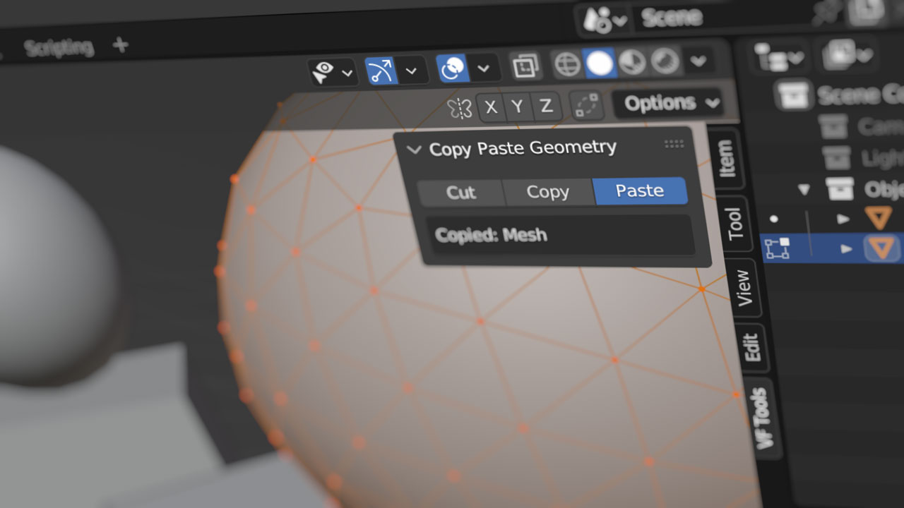
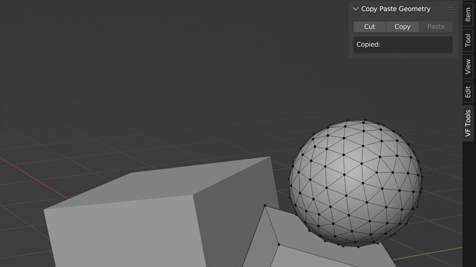

# VF Copy Paste Geometry
This add-on was designed for Blender version 2.8-4.1 (though not all previous versions may be fully supported). For Blender 4.2 and onwards, [please see the new Mesh Kit extension](https://github.com/jeinselen/Blender-MeshKit).

Adds object space copy and paste functionality for mesh and curve data in Blender.

This plugin uses persistent mesh and curve data blocks along with Blender's join operator to paste copied geometry to the current active object while in edit mode. This approach maintains the correct local materials without duplication because everything is handled internally, within the current project, which means it cannot paste between different projects or multiple Blender instances.

If you want copy/paste functionality _outside_ of the current project, you may want to check out [Edit Mode Copy Paste](https://github.com/OlesenJonas/Blender_EditModeCopyPaste) by Olesen Jonas. It uses the Blender buffer system and operates much like the Append operator; all data is treated as external content, and can end up duplicating associated assets like materials every time the data is pasted.

## Installation and Usage
- Download [VF_copyPasteGeometry.py](https://raw.githubusercontent.com/jeinselenVF/VF-BlenderCopyPasteGeometry/main/VF_copyPasteGeometry.py)
- Open Blender Preferences and navigate to the "Add-ons" tab
- Install and enable the add-on
- It will show up in the VF Tools tab in 3D View panels, where you can cut, copy, paste, along with a clipboard readout to track what kinds of elements are available for pasting
- Default keyboard shortcuts for all three major platforms are included, but can be customised by right-clicking on the buttons in the 3D View panel
  - `Command-X` (MacOS) or `Control-X` (Windows and Linux) to `cut`
  - `Command-C` (MacOS) or `Control-C` (Windows and Linux) to `copy`
  - `Command-V` (MacOS) or `Control-V` (Windows and Linux) to `paste`

When cutting or copying geometry or curve data, only the active object (out of all selected items) will be used as a data source, and the original geometry selection (when not cutting) will be maintained.

When pasting geometry or curve data, only the active object (out of all selected items) will be targeted, and the newly pasted geometry will be selected (the previous selection will be deselected).

All operations are matched to local object space, and cutting/copying/pasting elements in items that are scaled or rotated will ignore the _world space_ context.

## Notes

- This add-on is provided free without warranty or guarantee regarding suitability, security, safety, or otherwise. Use at your own risk.
